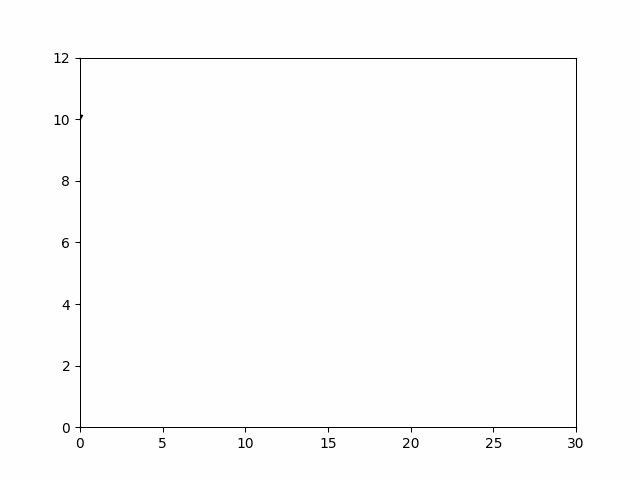
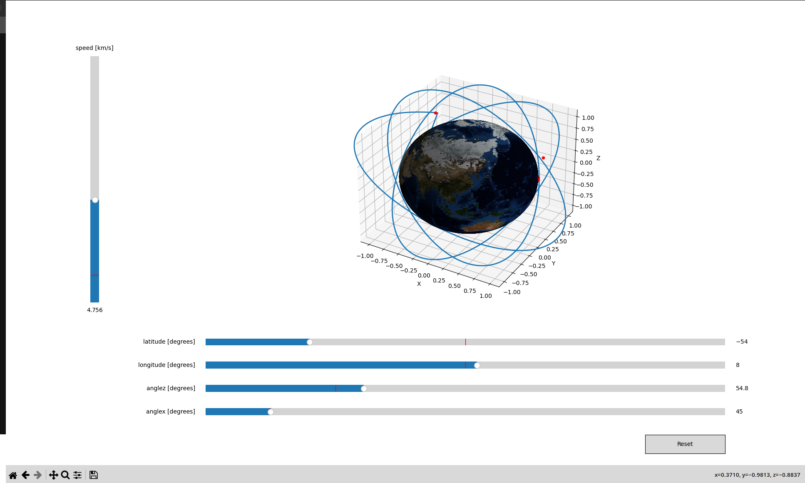
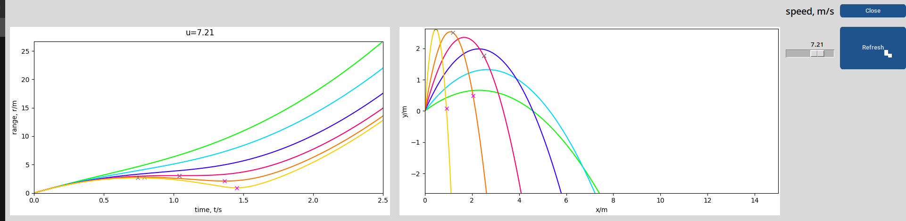
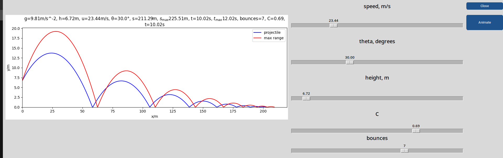
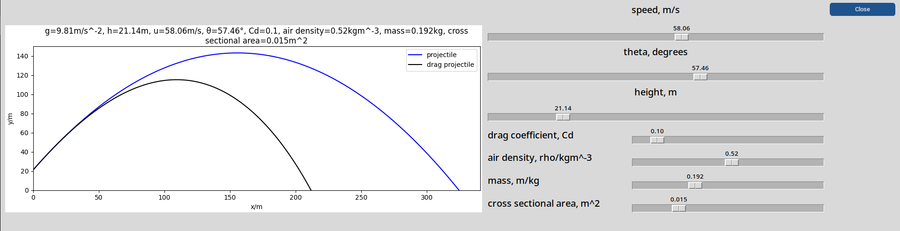

# BPhO Computational Challenge: Projectile Simulator

A high-fidelity physics engine and visualization tool designed for the British Physics Olympiad Computational Challenge.


## Demo








## Overview

This project simulates projectile motion under complex physical conditions that go beyond standard mechanics. It features a modular GUI built with CustomTkinter that allows users to interactively tweak parameters (drag coefficient, air density, restitution) and visualize the results in real-time using Matplotlib.

It was engineered to solve specific computational challenges ranging from basic kinematics to 3D orbital mechanics.

## Key Features

* **Advanced Drag Modeling**: Simulates quadratic air resistance (F_d proportional to v^2) taking into account air density and cross-sectional area.
* **Elastic Collisions**: Implements a coefficient of restitution to simulate energy loss during ground impacts (Bouncing Projectiles).
* **Bounding Parabolas**: Visualizes the safety envelope of potential trajectories for a given launch speed.
* **3D Simulation**: Extensions for visualizing motion in spherical coordinates and planetary gravity.
* **Interactive Dashboard**: A responsive UI with sliders for real-time parameter adjustment.

## Tech Stack

* **Language**: Python 3.10+
* **UI Framework**: CustomTkinter (Modern wrapper for Tkinter)
* **Visualization**: Matplotlib (embedded via FigureCanvasTkAgg)
* **Mathematics**: NumPy (Vectorized calculations)
* **Animation**: Pillow / Matplotlib Animation

## Project Structure

```text
bpho-challenge/
├── assets/                 # Resources (Earth textures, diagrams)
├── src/                    # Source code
│   ├── main.py             # Application entry point
│   ├── app.py              # Main GUI Controller
│   ├── pages/              # Challenge-specific simulation pages
│   └── physics/            # Physics engines (Particle, BParticle, DParticle)
├── experiments/            # Experimental scripts (3D, Sliders)
├── requirements.txt        # Project dependencies
└── README.md               # Documentation
```

## Installation

### Clone the repository:
```
Bash

git clone [https://github.com/samhussain25/bpho-challenge.git](https://github.com/samhussain25/bpho-challenge.git)
cd bpho-challenge
```

### Set up a virtual environment (Recommended):
```
Bash

# Linux/MacOS
python3 -m venv .venv
source .venv/bin/activate

# Windows
python -m venv .venv
.venv\Scripts\activate
```

### Install dependencies:
```
Bash

pip install -r requirements.txt
```
### Usage

To launch the main dashboard and access the 9 challenge simulations:
```
Bash

python src/main.py
```

## Navigation

Page 1-3: Basic Kinematics & Target Practice (High/Low ball).

Page 4-6: Range Maximization & Bounding Parabolas.

Page 7: Minima and Maxima. (more info in docstring for src/Page7.py

Page 8: Bouncing Projectiles (Coefficient of Restitution).

Page 9: Drag vs. No-Drag Comparison.

### The Physics

The simulation primarily uses Semi-Implicit Euler Integration for performance, updating position and velocity at discrete time steps (dt).

For drag simulations (Page 9), the acceleration is calculated dynamically:

$$ \vec{a} = \vec{g} - \frac{1}{2m} \rho C_d A v \vec{v} $$

Where:

rho = Air density

C_d = Drag coefficient

A = Cross-sectional area

Extensions

The experiments/ folder contains standalone scripts for:

3D Gravity: Simulating orbits around a spherical mass.

Spherical Projection: Mapping 3D coordinates for global visualizations.

## License

This project is open source and available under the MIT License.
